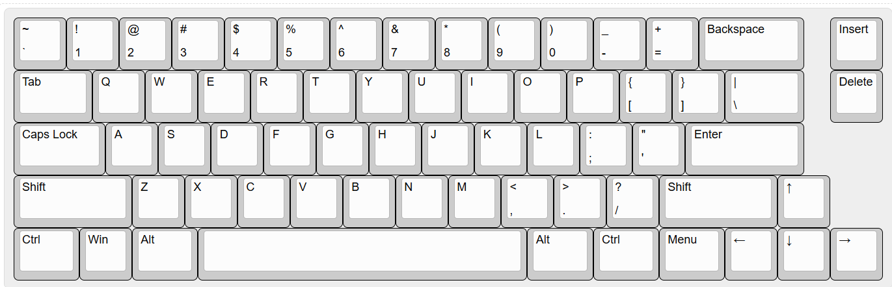
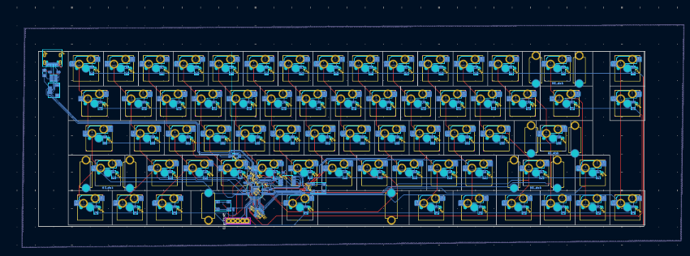
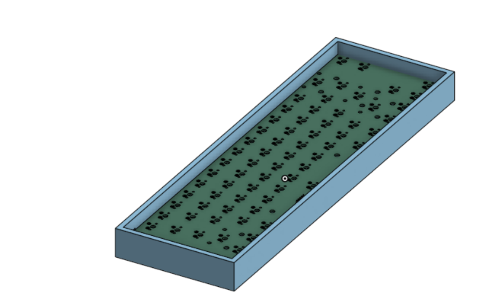

# GhostBoard

A 66‑key custom, hot‑swappable mechanical keyboard built around the RP2040 MCU and a USB‑C port.

## Key Features
- **Hot‑swappable sockets** (MX) allow you to change switches whenever you want without soldering.  
- Compact 66‑key layout inspired by Keychron’s design.  
- Fully two‑layer PCB with bottom‑side routing for a clean top surface.  

## Layout
Here’s the final Keyboard Layout Editor (KLE) grid I used for my 66‑key design:

## PCB
After routing all rows and columns on the bottom layer and placing 66 hot‑swap footprints on top, this is the final PCB:

## Case & CAD
The case was made in onshape and includes a cutout for the usbc port:

## BOM

| Components                     | Quantity | Price (USD) | Link                                      |
|--------------------------------|----------|-------------|-------------------------------------------|
|all the discrete components| bulk     | around $6 USD   | all from JLCPCB|
| Hot‑swap sockets (Cherry MX)   | 66       | $14 USD       | [from amazon](https://www.amazon.com/DUROCK-Mechanical-Keyboard-Switches-Hot-Swap/dp/B0B4W9YMGM?th=1)                                     |
| Cherry MX Brown switches       | 66       | $50 USD       | [from amazaon](https://www.amazon.com/Switches-Mechanical-Keyboards-Mounted-MX1AG1NA/dp/B09ZSR5WKH/ref=sr_1_1?crid=25HJUXP1OSN6J&dib=eyJ2IjoiMSJ9.JCXKItNl7G_bBJpSwKUJq664n-BOf2YbUH0WZa7hDmZxRafbLwI-glj977bGbt29tDvCveNze3P3gqmgoAn0l3rlchmQZ61RmHV2XPem3Jz3tot1azwV7jrsNV-PzRqVyuHCwUeeXaebcL0bObmG1d8kziBrCC7ZMtnRtgIo-ddwnsvz2wgowiUgUF-HD41rfdkHTE_UOYzvFpoSButMwc7_yddFstvRSoyNQbJw2ynUmxFPIG3dxOFQfZoTBf_ieIKHUoq1lWhQpLDM12rkFp4_vQ0Xz3IjDz0DVBT-efY.RL9APB_ELO4EKoe-h864Dvl7o-cF4AvWYBAotoN6pFo&dib_tag=se&keywords=cherry%2Bmx%2Bswitches%2Bbrown&qid=1753349383&s=electronics&sprefix=cherry%2Bmx%2Bswitches%2Bbrow%2Celectronics%2C191&sr=1-1&th=1)                                    |
| Stabilizer kit                 | 1        | $19 USD       | [from amazon](https://www.amazon.com/Keyboard-Stabilizers-Mechanical-Keyboards-Switches/dp/B0D2R13N2N/ref=sr_1_1_sspa?crid=2UC7ED8DWWUDM&dib=eyJ2IjoiMSJ9.P4sTVbDzkYqSr2Qe2aEKgUz9OjRmws6DREJdi517d7j9yxmY-mCmIoPxXbUmOFQNayDjFH5Sx7xpnLaN4KOjDOL0SpdCwoeUz22PRWkEPbsXPuUcYROyJJAhYlPQDTz6njqvp06jBaKfk85rN3X2qAGkjYN52kWKGrqK5ZmzdgV61Xb8_8AqggnEFYknCTHt.kM48GyCD-8_UloBzSZMtd7l1z-blnw8Z4I1GEPk9-0M&dib_tag=se&keywords=mx%2Bstabs&qid=1753349468&s=electronics&sprefix=mx%2Bstabs%2Celectronics%2C166&sr=1-1-spons&sp_csd=d2lkZ2V0TmFtZT1zcF9hdGY&th=1)
| RP2040 MCU board               | 1        | $1.20        | [pi-shop](https://www.pishop.us/product/raspberry-pi-rp2040/) |
| PCBs (×5, incl. shipping & tax) | 5        | $29.29       | using jlcpcb                               |

total price = $119.49