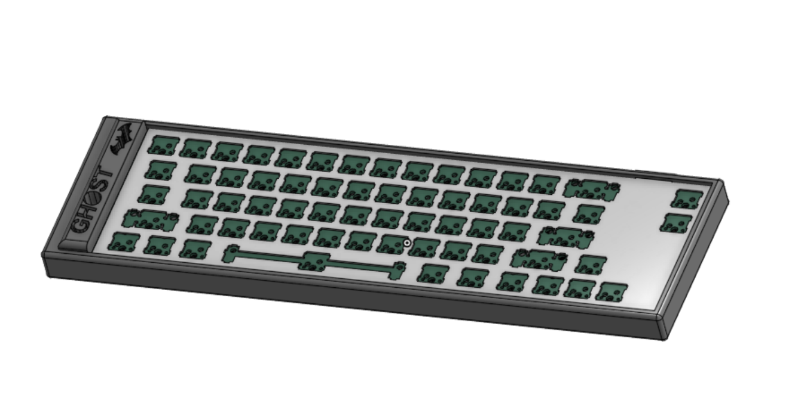

# GhostBoard

A 66‑key custom, hot‑swappable mechanical keyboard built around the RP2040 MCU and a USB‑C port.

## Key Features
- **Hot‑swappable sockets** (MX) allow you to change switches whenever you want without soldering.  
- Compact 66‑key layout inspired by Keychron’s design.  
- Fully two‑layer PCB with bottom‑side routing for a clean top surface.  

## Layout
Here’s the final Keyboard Layout Editor (KLE) grid I used for my 66‑key design:

## PCB
After routing all rows and columns on the bottom layer and placing 66 hot‑swap footprints on top, this is the final PCB:

## Case & CAD
The case was made in onshape and includes a cutout for the usbc port:

