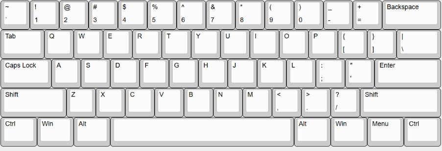

| Name | Date Started | Project Name | description | Total time |
|----------|----------|----------|----------|----------|
| Filmona  | July 20th| GhostBoard| Custom hotswap keyboard using the rp2040 mcu with a USBC receptacle         |   19.5       |

## Day 1  
Today I spent my team researching and reviewing other peoples github repos to get some insight on what it takes to make a keyboard and after deciding to do a 60% keyboard I tried oneshotting the schematics with the pi-pico dev board as the controller. But I ran into two issues. One being that the Keyboard Layout Editor plugin for the pcb wasn't working because it wasn't accepting my json file and the pi-pico had a micro usb connector.
 

I spent the rest of the day trying to figure out what went wrong with plugin. In the end I realized I just had to reset the switch annotations. 

 

Hours spent : 4.5 hours

## Day 2  

Again I started the day off with doing some researching, and I stumbled onto this youtube video series that solved my second issue of using a usbc connector:  
- [TKL Keyboard PCB Design, Part 1](https://www.youtube.com/watch?v=6Z49bynRqj8)

The guy in the youtube video used rp2040 which was the same MCU that's on the pi-pico, and also opted for hotswap sockets, so I restarted my schematic and switched from 60% with 61 keys to this 66 key hotswap design.

From this one video I learned a lot about the basics of electronic pcb designing. Stuff like decoupling and what crystals are for. I was actually able to use some of the information I learned from this tutorial on a seperate hackclub project I'm working on.  

Anyways, here's the schematic I ended up with after the first part in the tutorial

Hours spent: 5.5 hours

## Day 3  
This was my longest day because although there was a part two([TKL Keyboard PCB Design, Part 2 - YouTube](https://www.youtube.com/watch?v=YsHCpA9_U6s)) for me to follow a lot of it was different because of the leopold fc660m design I picked from the keyboard layout editor. 

I spent some 5-ish hours with some breaks in between doing the routing on the pcb because at one point KiCAD crashed and I hadn't saved the pcb so I had to start over again. After finishing and running the DRC I got two consistent errors that I could not remove: "Thermal relief connection to zone incomplete (layer B.Cu; zone min spoke count 2; actual 1)" and a weird vias unconnect error where random pins and components that are already connected to gnd have an airwire connecting back to a gnd via that is no where near it. 

As for the thermal relief connection even after making the wires as small as I could for the specific connections which are gnd connections on the usbc port, which is .3 mm, I still get that error. I don't think these errors will actually affect the pcb in the end because in the tutorial the guy had similar errors and he said to ignore them. 

Also the tutorial technically needed a 3rd part to do the switch matrix but I just did that part myself, so here's the final schematic version. 

So after finishing the pcb design, I spent some time going through jlcpcb to see if they had the parts I was looking for, found all the right links for those and for the actual switches and stuff and finished my BOM.

Hours Spent: 6.5 hours

## Day 4  
Today was a light day and after spending some time going over my work, I made a pretty simple case using onshape. 

To finish out the project, I setup my custom qmk file using the easyQMK tutorial by Anicetus

[EasyQMK](https://easyqmk.anicetus.dev/)

But like always during this proccess I ran into some weird layout error that didn't really make sense, but every since I watched a video in which some youtuber said that he solved an error he had by just including one extra line in one of his configuration files I was anticipaitng this moment. And even though I did make some other changes as well, I finally got the file compiled. 

And now I'm half way done with the whole thing. Just need to wait for my parts to arrive.

Hours spent: 3 hours